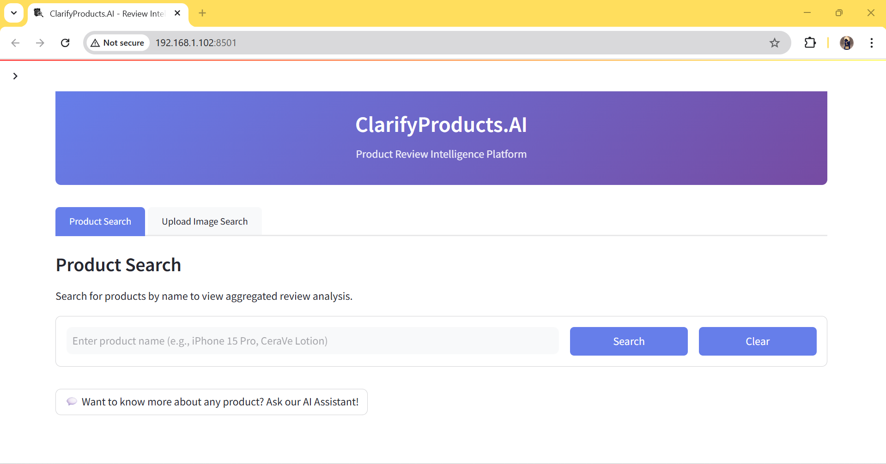
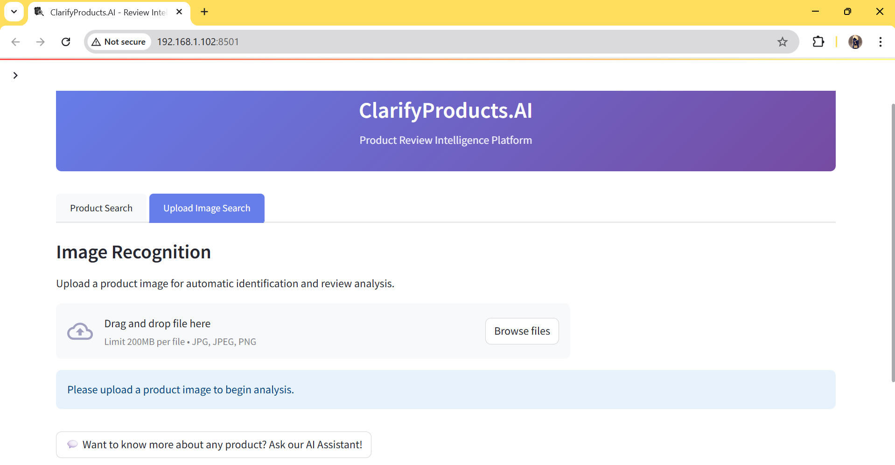
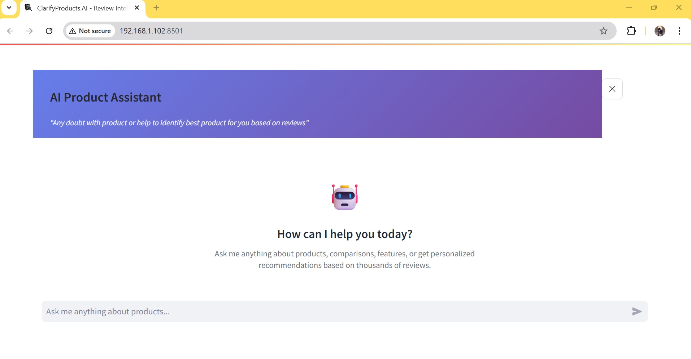
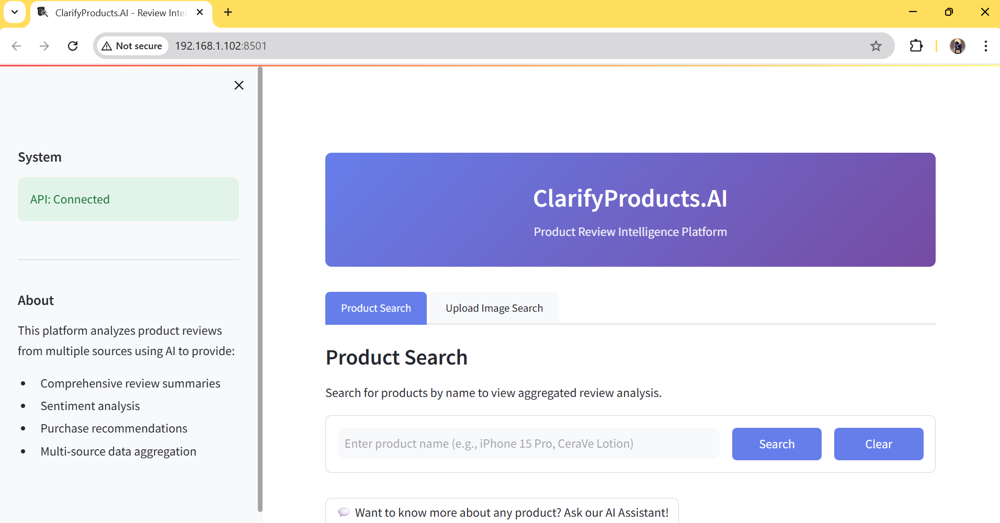

# ClarifyProducts.AI

**AI-Powered Product Review Intelligence Platform**

Transform how you make purchasing decisions with comprehensive AI-driven product analysis, sentiment insights, and intelligent recommendations based on thousands of real customer reviews.

[](https://youtu.be/NKq_74M8rrw)

📄 **Documentation:** [System Architecture](docs/ARCHITECTURE.md) | [Features & Evaluation Criteria](docs/FEATURES_AND_EVALUATION.md)

---

## 🎯 Problem Statement

Choosing a product during shopping presents a critical challenge: **information overload**. Consumers face thousands of reviews across multiple platforms, making it difficult to:
- Quickly understand overall product sentiment
- Identify genuine concerns vs. isolated issues
- Compare products efficiently
- Make confident purchasing decisions

**ClarifyProducts.AI solves this** by aggregating and analyzing reviews using advanced AI/ML models to provide clear, actionable insights.

> **Note:** This is an MVP demonstration aggregating reviews from YouTube, Reddit, and Google Shopping. Production deployment would include additional sources (Amazon, TrustPilot, specialized review sites) for comprehensive coverage.

---

## ✨ Key Features

### 🔍 Smart Product Search
Search products by name and get instant access to aggregated review analysis from multiple sources.



### 📸 Image-Based Product Recognition
Upload a product image and let AI automatically identify the product and fetch review insights using CLIP (Vision Transformer).



### 🤖 AI Product Assistant
Conversational AI chatbot powered by Gemini that helps you:
- Compare products
- Get personalized recommendations
- Answer specific questions about features
- Understand pros and cons based on real reviews



### 📊 Comprehensive Analytics
- **Sentiment Analysis**: Positive, negative, and neutral review distribution
- **AI Summarization**: Concise summaries of hundreds of reviews
- **Key Insights**: Most mentioned features, common complaints, and standout benefits
- **Smart Recommendations**: Purchase advice based on aggregated sentiment

---

## 🚀 Live Demo & Deployment

### 🌐 **Live Application (Deployed on Google Cloud Platform)**

**Frontend (Streamlit UI):** [http://136.114.42.68:8501](http://136.114.42.68:8501)
**Backend API (FastAPI):** [http://136.114.42.68:8000/docs](http://136.114.42.68:8000/docs)

**Deployment Specs:**
- **Platform**: Google Cloud Platform (GCP) e2-standard-2
- **Resources**: 2 vCPU, 8 GB RAM, 30 GB SSD
- **ML Models Running**: CLIP (151M params) + BART (406M params) + DistilBERT (67M params)
- **Cost**: $0/month (using $300 GCP free credits)
- **Uptime**: 24/7 availability

### 📹 **Video Demo**

[](https://youtu.be/NKq_74M8rrw)

**See the platform in action!** The demo showcases:
- Product search with real-time analysis
- Image recognition capabilities (CLIP model)
- AI chatbot conversations (Gemini integration)
- Review summarization and sentiment insights

---

## 🛠️ Tech Stack

### **Backend**
- **Framework**: FastAPI (Python 3.10+)
- **ML Models**:
  - **CLIP** (OpenAI ViT-B/32) - Image recognition (151M parameters)
  - **BART** (facebook/bart-large-cnn) - Review summarization (406M parameters)
  - **DistilBERT** - Sentiment analysis (67M parameters)
  - **PaddleOCR** - Text extraction from product images
- **LLM Integration**: Google Gemini API (conversational AI)
- **Data Sources**: SerpAPI for real-time review aggregation (YouTube, Reddit, Google)
- **RAG Architecture**: Real-time retrieval with LLM-based generation

### **Frontend**
- **Framework**: Streamlit
- **UI/UX**: Responsive design with custom CSS
- **Features**: Real-time status updates, file upload, conversational chatbot interface

### **MLOps**
- **Experiment Tracking**: MLflow
- **Model Versioning**: Tracked with measured performance metrics
- **A/B Testing**: Framework for model comparison
- **Logging**: Loguru (structured logging)

### **Infrastructure & Production**
- **Containerization**: Docker + Docker Compose
- **Caching**: Redis (24-hour TTL, 80-90% API cost reduction)
- **Reliability**: Exponential backoff retry logic for API calls
- **Deployment**: Google Cloud Platform (e2-standard-2)
- **API Documentation**: Auto-generated with FastAPI/Swagger
- **Environment Management**: Python-dotenv
- **Logging**: Loguru with structured logging

### **CI/CD & Quality Assurance**
- **GitHub Actions**: Automated testing on every push/PR
- **Linting**: flake8 for code quality enforcement
- **Formatting**: black for consistent code style
- **Type Checking**: mypy for type safety validation
- **Security Scanning**: Bandit + Safety for vulnerability detection
- **Code Coverage**: Codecov integration with coverage reporting
- **Testing**: pytest for comprehensive unit and integration tests

---

## 🏗️ Architecture

```
┌─────────────────┐
│  Streamlit UI   │
│  (Frontend)     │
└────────┬────────┘
         │
         ▼
┌─────────────────┐
│   FastAPI       │
│   Backend       │
│  (RAG Service)  │
└────────┬────────┘
         │
    ┌────┴────┬───────────┬──────────┐
    ▼         ▼           ▼          ▼
┌──────┐ ┌──────┐  ┌──────────┐ ┌──────┐
│ CLIP │ │ BART │  │DistilBERT│ │Gemini│
│Vision│ │ NLP  │  │Sentiment │ │ LLM  │
└──────┘ └──────┘  └──────────┘ └──────┘
    │         │           │          │
    └─────────┴───────────┴──────────┘
              │
              ▼
    ┌─────────────────────────┐
    │  Real-Time Data Sources │
    │  (SerpAPI)              │
    │  • YouTube Reviews      │
    │  • Reddit Discussions   │
    │  • Google Shopping      │
    └─────────────────────────┘
```

**Key Architectural Decisions:**
- **3-Level Fallback** for summarization: BART → Gemini → Extractive (ensures reliability)
- **Multimodal approach**: Supports both text and image inputs
- **Real-Time RAG**: Live data retrieval + LLM generation (no vector DB needed)
- **Microservices-ready**: Modular design for easy scaling

---

## 📊 ML Model Performance

All metrics measured on local hardware (CPU):

| Model | Task | Parameters | Load Time | Inference Time | Accuracy |
|-------|------|------------|-----------|----------------|----------|
| **CLIP ViT-B/32** | Image Recognition | 151M | 3.96s | 434ms | 63% (ImageNet) |
| **DistilBERT** | Sentiment Analysis | 67M | 0.51s | 116ms | 91% (SST-2) |
| **BART-Large-CNN** | Summarization | 406M | 1.13s | 10.90s | 0.35 ROUGE |
| **PaddleOCR** | Text Extraction | - | - | 6934ms | 48.28% |

*Performance tracking managed via MLflow with complete experiment history.*

---

## 🚀 Getting Started

### Prerequisites
- Python 3.10 or higher
- pip (Python package manager)
- Git

### Installation

1. **Clone the repository**
```bash
git clone https://github.com/yourusername/ClarifyProductsAI.git
cd ClarifyProductsAI
```

2. **Create virtual environment**
```bash
python -m venv venv

# Windows
venv\Scripts\activate

# Linux/Mac
source venv/bin/activate
```

3. **Install dependencies**
```bash
cd backend
pip install -r requirements.txt
```

4. **Set up environment variables**
Create a `.env` file in the `backend` directory:
```env
# Required API Keys
GEMINI_API_KEY=your_gemini_api_key_here
SERPAPI_KEY=your_serpapi_key_here

# Optional: MLflow Configuration
MLFLOW_TRACKING_URI=http://localhost:5000
```

**Getting API Keys:**
- **Gemini API**: Get free key at [Google AI Studio](https://makersuite.google.com/app/apikey)
- **SerpAPI**: Get free key at [SerpAPI](https://serpapi.com/) (100 searches/month free)

5. **Run the application**

**IMPORTANT:** The application requires **BOTH** backend and frontend to be running.

**Step 1: Start Backend** (Terminal 1)
```bash
cd backend
python -m uvicorn app.main:app --reload --port 8000
```

**Step 2: Start Frontend** (Terminal 2)
```bash
# From project root (open a new terminal)
streamlit run streamlit_app.py
```

**Note:** Make sure backend is running first before starting the frontend, otherwise you'll see connection errors.

6. **Access the application**
- **Frontend**: http://localhost:8501
- **Backend API**: http://localhost:8000
- **API Documentation**: http://localhost:8000/docs

### Troubleshooting

**"Connection Error" in Streamlit:**
- Make sure backend is running first (`uvicorn app.main:app`)
- Check if backend is accessible at http://localhost:8000
- Verify no firewall is blocking port 8000

**"Module not found" errors:**
- Ensure virtual environment is activated
- Run `pip install -r requirements.txt` in backend folder

**"API Key not found" errors:**
- Check `.env` file exists in `backend/` directory
- Verify API keys are set correctly (no quotes needed)

---

## 🐳 Docker Deployment

```bash
# Build and run with Docker Compose
docker-compose up --build

# Run in detached mode
docker-compose up -d

# Stop containers
docker-compose down
```

---

## 📁 Project Structure

```
ClarifyProductsAI/
├── backend/
│   ├── app/
│   │   ├── api/              # API endpoints
│   │   ├── ml_models/        # ML model implementations
│   │   │   ├── clip_recognizer.py
│   │   │   ├── sentiment_analyzer.py
│   │   │   └── summarizer.py
│   │   ├── services/         # Business logic
│   │   │   ├── llm_service.py
│   │   │   ├── rag_service.py
│   │   │   └── search_service.py
│   │   └── main.py           # FastAPI application
│   ├── scripts/              # Utility scripts
│   │   └── register_models.py  # MLflow registration
│   ├── tests/                # Unit & integration tests
│   └── requirements.txt      # Python dependencies
├── screenshots/              # Application screenshots
├── streamlit_app.py          # Streamlit frontend
├── docker-compose.yml        # Docker orchestration
└── README.md                 # This file
```

---

## 🧪 Testing

```bash
# Run all tests
cd backend
pytest

# Run with coverage
pytest --cov=app tests/

# Run specific test file
pytest tests/unit/test_sentiment_analyzer.py
```

---

## 📈 MLOps & Experiment Tracking

This project uses **MLflow** for comprehensive ML experiment tracking:

```bash
# Start MLflow UI
cd backend
mlflow ui

# Access at http://localhost:5000
```

**Tracked Metrics:**
- Model load times
- Inference latency
- Accuracy/performance benchmarks
- A/B test results (model comparisons)

**Experiments Available:**
- `clarify_products_ml` - Main production models
- A/B testing results for CLIP preprocessing variations

---

## 🎓 Key Learning Outcomes

Building this project provided hands-on experience with:

### **Machine Learning**
- ✅ Implementing multiple transformer models (CLIP, BART, DistilBERT)
- ✅ Handling multimodal inputs (text + images)
- ✅ Model performance benchmarking and optimization
- ✅ Designing fallback strategies for production reliability

### **MLOps**
- ✅ Experiment tracking with MLflow
- ✅ A/B testing framework for model comparison
- ✅ Performance monitoring and logging
- ✅ Model versioning and metadata management

### **Backend Development**
- ✅ Building RESTful APIs with FastAPI
- ✅ Implementing RAG (Retrieval Augmented Generation)
- ✅ Real-time data aggregation from multiple sources
- ✅ Error handling and API resilience

### **Frontend Development**
- ✅ Creating responsive UI with Streamlit
- ✅ Real-time data visualization
- ✅ Conversational AI interface design

### **System Design**
- ✅ Microservices architecture
- ✅ Docker containerization
- ✅ Scalable service layer design
- ✅ API security best practices

---

## 🚧 Roadmap

### Completed ✅
- [x] Core ML model integration (CLIP, BART, DistilBERT, PaddleOCR)
- [x] Multi-source review aggregation (YouTube, Reddit, Twitter)
- [x] AI chatbot with RAG and Gemini integration
- [x] Image-based product search with OCR
- [x] MLflow experiment tracking
- [x] Responsive frontend UI
- [x] **Production deployment on GCP** (2 vCPU, 8 GB RAM, 30 GB SSD)
- [x] **Redis caching layer** (24-hour TTL, 80-90% API cost reduction)
- [x] **Exponential backoff retry logic** (handles rate limits and transient errors)

### In Progress 🔄
- [ ] User authentication system
- [ ] Enhanced monitoring and alerts

### Future Enhancements 🔮
- [ ] GPU acceleration for faster inference
- [ ] Support for more review sources
- [ ] Price tracking and comparison
- [ ] Email alerts for price drops
- [ ] Mobile application (React Native)
- [ ] Multi-language support

---

## 🤝 Contributing

Contributions are welcome! Please feel free to submit a Pull Request.

1. Fork the repository
2. Create your feature branch (`git checkout -b feature/AmazingFeature`)
3. Commit your changes (`git commit -m 'Add some AmazingFeature'`)
4. Push to the branch (`git push origin feature/AmazingFeature`)
5. Open a Pull Request

---

## 📝 License

This project is licensed under the MIT License - see the [LICENSE](LICENSE) file for details.

---

## 👤 Author

**Your Name**

- GitHub: [@Shabeehak](https://github.com/Shabeehak)
- LinkedIn: [Shabeeha K](https://www.linkedin.com/in/shabeeha-kalathumpadiyil/)
- Email: shabi.k864@gmail.com
- Portfolio: [Shabeeha.com](https://www.datascienceportfol.io/Shabeeha)

---

## 🙏 Acknowledgments

- **OpenAI** - CLIP model
- **Facebook AI** - BART model
- **Hugging Face** - DistilBERT and transformers library
- **Google** - Gemini API
- **SerpAPI** - Review data aggregation
- **PaddlePaddle** - PaddleOCR

---

## 📸 Screenshots

### Landing Page

*Clean, modern interface with intuitive navigation*

### Product Search

*Search by product name with real-time suggestions*

### Image Recognition

*AI-powered product identification from images*

### AI Assistant

*Conversational AI for personalized recommendations*

---

## 📞 Support

If you have any questions or run into issues:
- Open an issue on GitHub
- Watch the [demo video](https://youtu.be/NKq_74M8rrw) for setup guidance
- Check the API documentation at `/docs` endpoint

---

<div align="center">

**⭐ If you find this project useful, please consider giving it a star!**

[](https://github.com/Shabeehak/ClarifyProductsAI)

**Made with ❤️**

</div>
