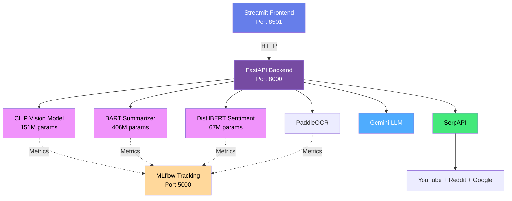
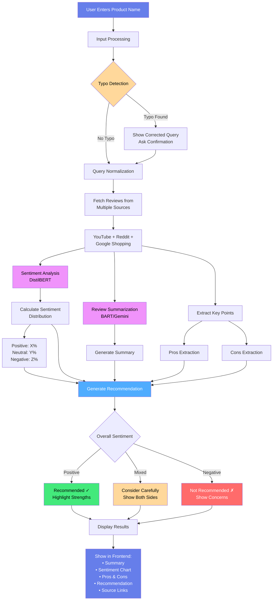
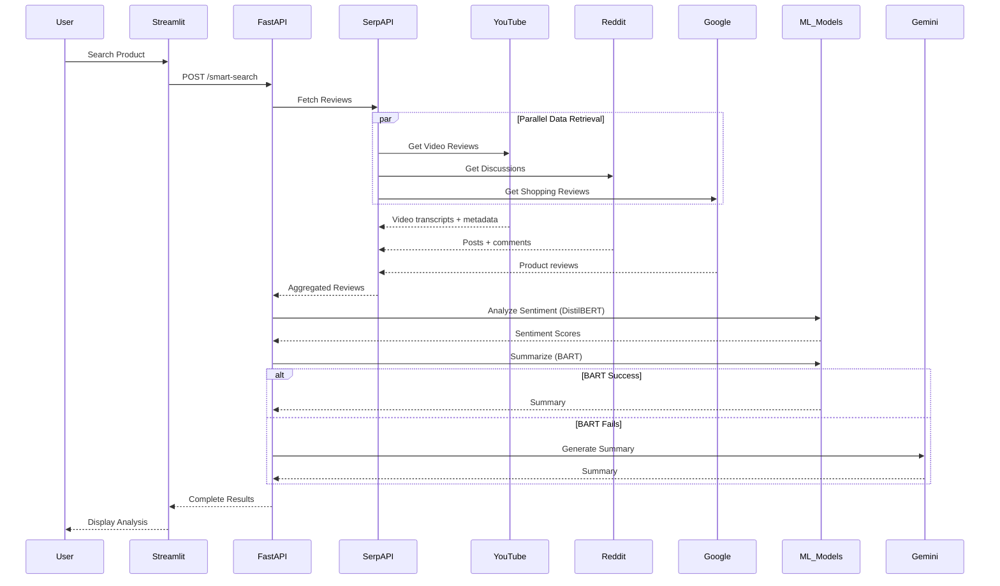
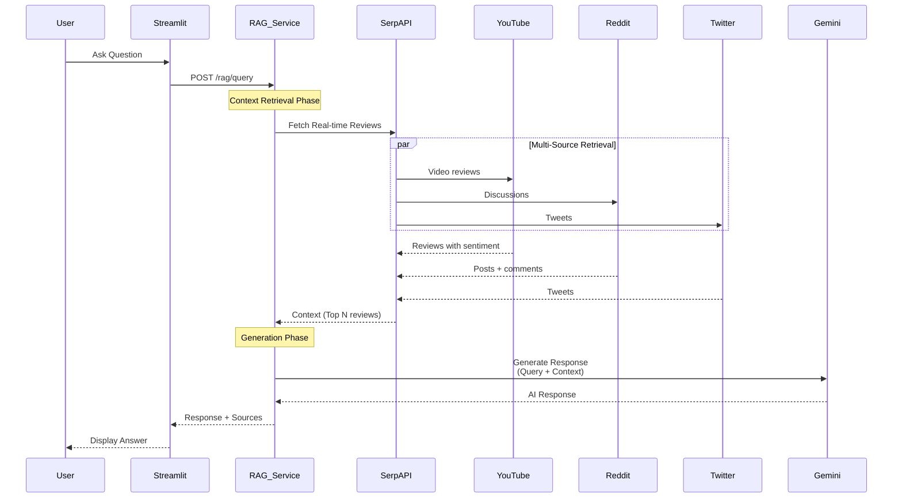
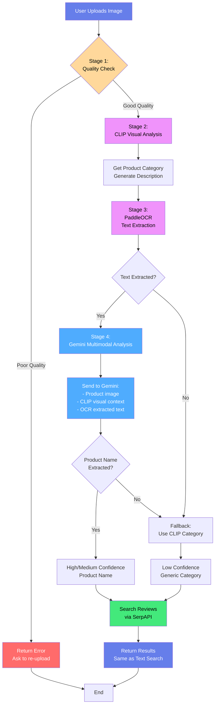
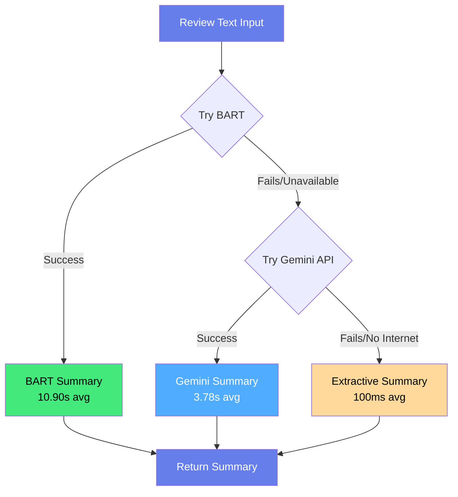
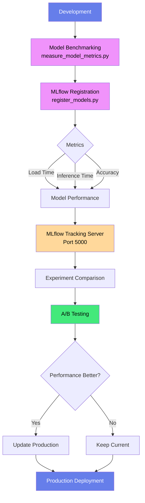
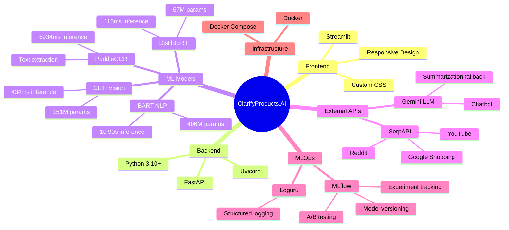
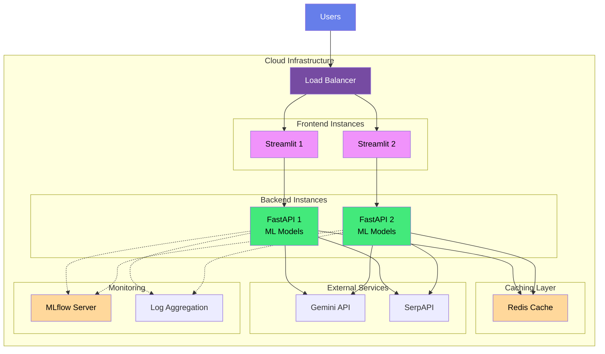

# ClarifyProducts.AI - System Architecture

## System Overview

ClarifyProducts.AI is an ML-powered product review analysis platform that aggregates reviews from multiple sources (YouTube, Reddit, Google Shopping) and provides sentiment analysis, summarization, and conversational AI capabilities. The system supports both text-based and image-based product search.

## High-Level Architecture

## Data Flow Architecture

### Text Search User Experience Flow

**User-Facing Features:**
- **Typo Correction:** Detects and suggests corrections for misspelled product names
- **Query Normalization:** Standardizes product names for better search results
- **Sentiment Distribution:** Visual breakdown of positive, neutral, and negative reviews
- **AI Summarization:** Concise summary of hundreds of reviews in 2-3 sentences
- **Pros & Cons Extraction:** Key strengths and weaknesses identified from reviews
- **Smart Recommendations:** Purchase advice based on overall sentiment and review analysis
- **Source Attribution:** Direct links to YouTube videos, Reddit discussions, and shopping sites

---

### Product Search Backend Flow

**Key Features:**
- **Multi-Source Aggregation:** Parallel data retrieval from YouTube, Reddit, and Google Shopping
- **ML-Powered Analysis:** DistilBERT for sentiment (91% accuracy), BART for summarization (406M params)
- **Fallback Strategy:** BART → Gemini → Extractive summarization for reliability
- **Real-Time Data:** Always fresh reviews from multiple platforms

---

### RAG Chatbot Flow

**Key Features:**
- **Real-Time Context Retrieval:** Fetches latest reviews from YouTube, Reddit, Twitter for current product info
- **Two-Phase Architecture:** Context Retrieval → Generation (RAG pattern)
- **Source Attribution:** Returns response with sources for transparency
- **Gemini LLM:** Uses Gemini for fast, accurate response generation based on real-time context

---

## Image Recognition Flow

**Pipeline Stages:**

1. **Quality Check** → Reject poor images (blurry, too dark, too small)
2. **CLIP Analysis** → ML model (151M params) extracts visual features and product category
3. **OCR Extraction** → PaddleOCR extracts text from packaging
4. **Gemini Multimodal** → Receives image + CLIP context + OCR text for accurate product identification
5. **Fallback** → If text not found or Gemini fails, uses CLIP category
6. **Search Reviews** → Same flow as text search (SerpAPI → ML analysis)

**Why use CLIP if Gemini can see the image?**
- **CLIP provides structured ML context:** Category classification from 70+ product types, reducing Gemini's search space
- **Faster inference:** CLIP pre-processes visual features (434ms) before Gemini analysis
- **Hybrid approach:** Combines ML feature extraction (CLIP) with LLM reasoning (Gemini) for best accuracy
- **Demonstrates ML engineering:** Shows ability to integrate multiple models rather than relying on single API

## 3-Level Summarization Fallback

**Fallback Strategy:**
- **Level 1 - BART (Primary):** Best quality, offline-capable, 406M parameter transformer model
- **Level 2 - Gemini (Fallback 1):** Fast, reliable cloud-based summarization when BART unavailable
- **Level 3 - Extractive (Fallback 2):** Always works, basic quality, no external dependencies
- **Production Reliability:** Ensures summarization always succeeds regardless of environment constraints

---

## RAG Chatbot Architecture

**Architecture Overview:**
- **Retrieval-Augmented Generation (RAG):** Combines real-time data retrieval with LLM generation
- **Context-Aware Responses:** Gemini receives product-specific reviews as context for accurate answers
- **Source Transparency:** All responses include sources (YouTube, Reddit, Twitter) for user verification
- **No Vector Database:** Uses real-time retrieval instead of pre-indexed embeddings for always-current data

---

## MLOps Pipeline

**MLOps Workflow:**
- **Model Benchmarking:** Measure load time, inference time, and accuracy for all ML models
- **MLflow Registration:** Register models with metadata and performance metrics in MLflow tracking server
- **Experiment Tracking:** Compare different model versions, preprocessing approaches, and hyperparameters
- **A/B Testing Framework:** Systematic comparison of model performance before production deployment
- **Data-Driven Decisions:** Update production models only when metrics demonstrate clear improvement

---

## Technology Stack Overview

## Deployment Architecture (Future)

**Scalability Plan:**
- **Horizontal Scaling:** Multiple frontend and backend instances behind load balancer
- **Caching Layer:** Redis for frequently requested product reviews and analysis results
- **Stateless Architecture:** Each backend instance can handle any request independently
- **Monitoring & Observability:** MLflow for model metrics, centralized logging for system health
- **Current Status:** Single-instance development setup, production deployment planned

---

## Key Architectural Decisions

### 1. Real-Time Data Retrieval (No Vector DB)
**Why:** Product reviews change frequently. Real-time retrieval ensures always-current data without maintaining an embedding pipeline.

**Trade-offs:**
- ✅ Always fresh data
- ✅ Simpler architecture
- ✅ Lower storage costs
- ❌ Slightly slower first request (API call latency)
- ❌ Depends on external API availability

### 2. 3-Level Summarization Fallback
**Why:** Production reliability. BART provides best quality but may fail on resource-constrained environments.

**Fallback Order:**
1. **BART** (Primary) - Best quality, offline-capable
2. **Gemini** (Fallback 1) - Fast, reliable, requires internet
3. **Extractive** (Fallback 2) - Always works, basic quality

### 3. Multimodal Input Support
**Why:** Users may not know exact product names. Image recognition provides alternative entry point.

**Implementation:**
- PaddleOCR for text extraction from packaging
- CLIP for visual product classification
- Confidence-based fallback (text → visual → category)

### 4. Stateless Backend
**Why:** Easier to scale horizontally. Each request is independent.

**Benefits:**
- Can run multiple backend instances
- Load balancing friendly
- No session management complexity

### 5. MLflow for Experiment Tracking
**Why:** Professional ML engineering. Track model performance over time.

**Use Cases:**
- Compare model versions
- A/B testing (e.g., CLIP preprocessing variations)
- Performance monitoring
- Reproducibility

---

## Performance Characteristics

### Request Latency Breakdown

Typical product search request (text-based):

| Stage | Component | Latency | Notes |
|-------|-----------|---------|-------|
| 1. API Request | FastAPI | ~50ms | Request handling and validation |
| 2. Data Retrieval | SerpAPI | ~2000ms | Fetch reviews from multiple sources |
| 3. Sentiment Analysis | DistilBERT | ~116ms | Analyze all reviews for sentiment |
| 4. Summarization | BART | ~10900ms | Generate concise summary |
| 5. Response Formatting | FastAPI | ~50ms | Structure and return results |

**Total End-to-End Latency:** ~13 seconds

**Performance Optimization Opportunities:**
- **Caching:** Store frequently requested product reviews (Redis)
- **Parallel Processing:** Run sentiment analysis and summarization concurrently
- **GPU Acceleration:** Faster inference for BART and DistilBERT models
- **Async Processing:** Non-blocking I/O for external API calls
- **Model Optimization:** Quantization or distillation for faster inference

---

## Security Considerations

1. **API Keys:** Stored in `.env`, never committed
2. **Input Validation:** FastAPI request validation
3. **Rate Limiting:** Prevent API abuse (future enhancement)
4. **CORS:** Configured for frontend-backend communication
5. **Dependency Scanning:** Regular updates for vulnerabilities

---

## Scalability Considerations

**Current Architecture:**
- Single-instance deployment suitable for demonstration and development
- Estimated throughput: ~10 requests/minute
- Low infrastructure cost

**Production Scalability Path:**
- Horizontal scaling with load balancer (Nginx/Traefik)
- Multiple backend replicas for increased throughput
- Redis caching layer for frequently requested reviews
- Message queue (RabbitMQ/Celery) for async processing
- Dedicated ML model serving (TensorFlow Serving/TorchServe)
- CDN for static frontend assets

---

## Monitoring & Observability

**Implemented:**
- MLflow for ML model metrics and experiment tracking
- Loguru for structured application logging
- FastAPI automatic API documentation (Swagger/OpenAPI)

**Production Enhancements:**
- Prometheus + Grafana for system metrics visualization
- Sentry for error tracking and alerting
- ELK Stack (Elasticsearch, Logstash, Kibana) for log aggregation
- Custom dashboards for request latency and model performance monitoring
